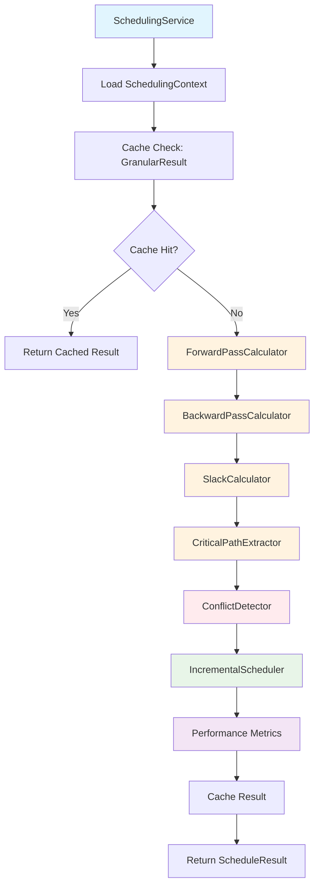
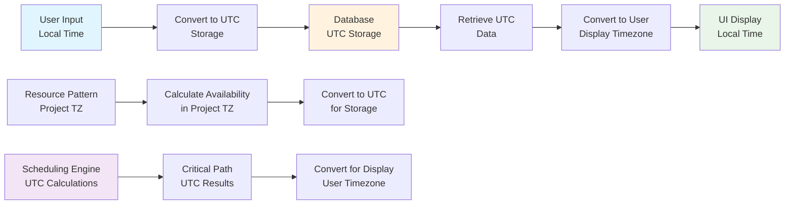
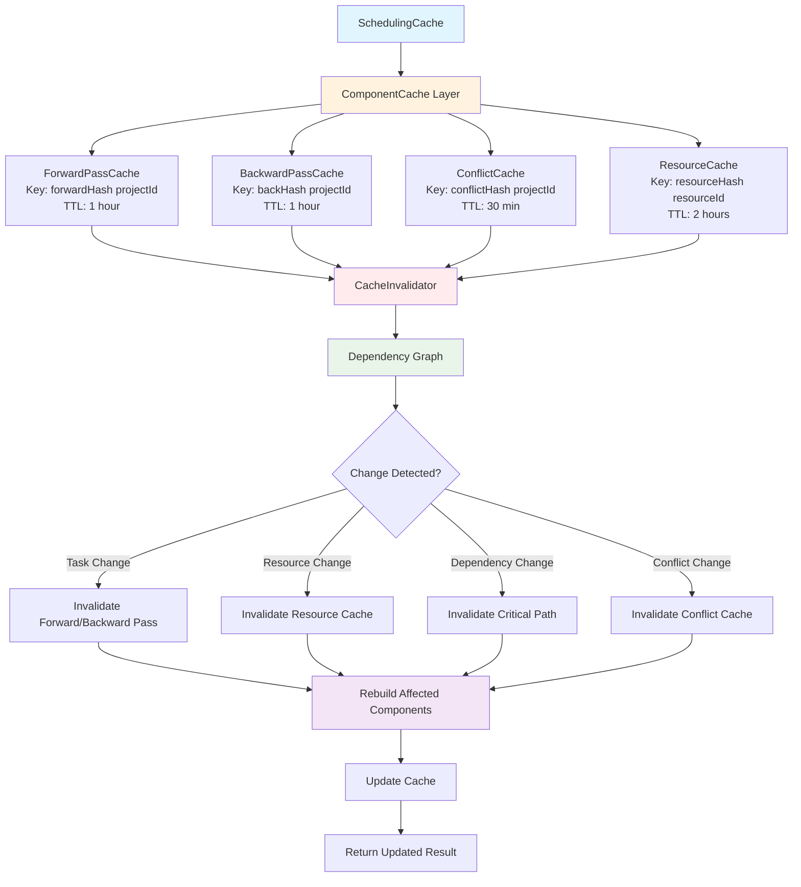
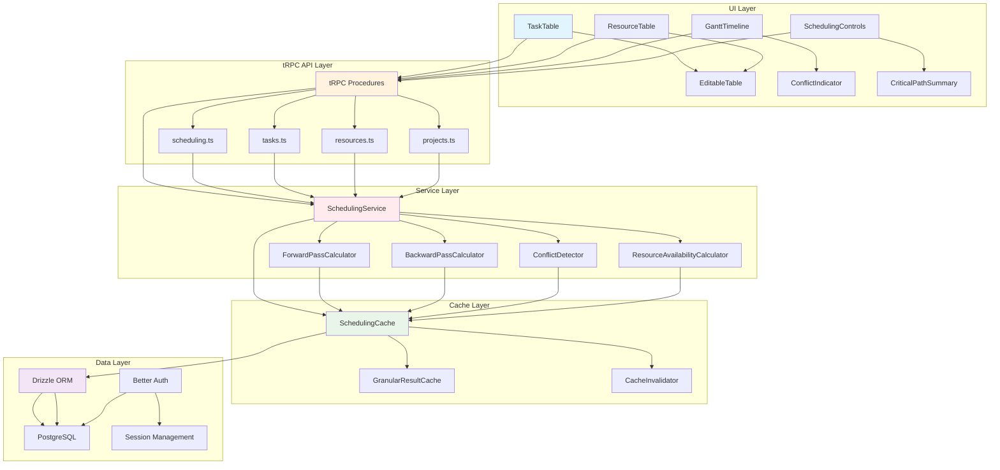
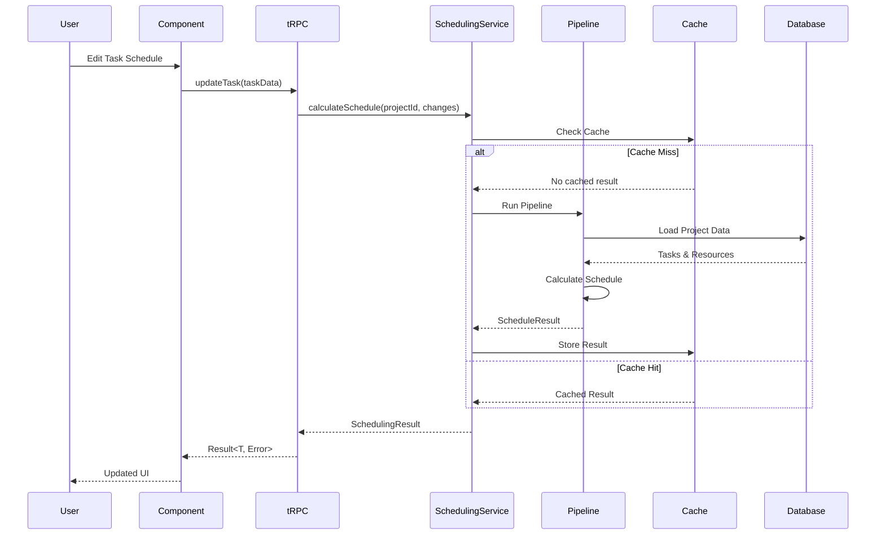

# Architecture Decision Document

_This document builds collaboratively through step-by-step discovery. Sections are appended as we work through each architectural decision together._

## Executive Summary

**Project:** wale-plan - Advanced Project Management with Day-Specific Scheduling
**Status:** Architecture Complete ✅ | Ready for Implementation
**Date:** December 2, 2025

### Core Innovation
wale-plan delivers **Microsoft Project's power** with a revolutionary **day-specific scheduling engine** that breaks from traditional uniform-week assumptions. This enables sophisticated resource management with variable daily patterns, time zone support, and real-time performance optimization.

### Key Architectural Decisions

| Decision | Choice | Impact |
|----------|--------|---------|
| **Technology Stack** | T3 Stack (Next.js 15 + tRPC 11 + Drizzle 0.41) | End-to-end type safety with enterprise-grade performance |
| **Scheduling Engine** | Modular Pipeline + SchedulingService | Testable, performant algorithm foundation |
| **Performance Strategy** | Incremental Graph Diff + Granular Caching | Sub-second recalculation for 200+ tasks |
| **UI Architecture** | Shared Table Primitives + ShadCN Components | Consistent experience across complex interfaces |
| **Data Integration** | Result<T, Error> Pattern + Hybrid Validation | Type-safe error handling throughout system |

### Technical Differentiators

**🚀 Day-Specific Scheduling Engine**
- Forward/backward pass algorithms respecting variable daily availability
- Resource patterns: Mon-Fri, weekends, custom schedules with different rates
- Time zone support for distributed teams
- Real-time conflict detection with incremental updates

**⚡ Performance Architecture**
- Sub-second project recalculation (NFR1 compliance)
- Sub-100ms UI interactions (NFR2 compliance)
- Intelligent caching with dependency graph invalidation
- Linear scalability to 300+ tasks

**🛡️ Enterprise Foundation**
- Multi-tenant architecture with Better Auth
- Type-safe APIs from database to UI
- GDPR compliance with audit trails
- Horizontal scaling readiness

### Implementation Readiness

**Immediate Priority:** Modular pipeline foundation in `/lib/scheduling/pipeline/`
- ForwardPassCalculator, BackwardPassCalculator, SlackCalculator
- Component development and testing can proceed independently
- UI integration follows established patterns

**Team Guidelines:**
- All AI agents must follow documented naming conventions
- Result<T, Error> pattern mandatory for all operations
- Immutable context objects in scheduling pipeline
- Granular caching with intelligent invalidation

This architecture provides a production-ready foundation that delivers competitive advantage through innovative scheduling technology while maintaining enterprise-grade reliability and performance.

## Quick Reference Guide

### 🚀 Implementation Priorities

**Phase 1: Core Pipeline (Week 1-2)**
1. Set up modular pipeline components in `/lib/scheduling/pipeline/`
2. Implement granular caching with dependency graph invalidation
3. Create shared table primitives (`EditableTable`, `EditableCell`)
4. Add timezone conversion utilities

**Phase 2: UI Integration (Week 2-3)**
1. Build scheduling-specific components using shared primitives
2. Implement Result<T, Error> pattern throughout tRPC procedures
3. Add React Query integration with optimistic updates
4. Create project navigation and dashboard layout

**Phase 3: Performance Optimization (Week 3-4)**
1. Implement incremental graph diff conflict detection
2. Add performance metrics tracking for NFR compliance
3. Optimize database queries with proper indexing
4. Test with 200+ task projects for performance validation

### 📋 Critical Implementation Rules

**Mandatory Patterns:**
```typescript
// All API responses must use Result<T, Error>
type SchedulingResult<T> =
  | { ok: true; data: T; performance: PerformanceMetrics }
  | { ok: false; error: SchedulingError };

// All pipeline stages use immutable context
interface SchedulingContext {
  readonly project: Project;
  readonly tasks: Task[];
  readonly resources: Map<string, Resource>;
  // ... other readonly properties
}

// Cache keys must be deterministic
const cacheKey = `schedule:${projectId}:${hash(inputData)}`;
```

**Naming Conventions:**
- Database: `camelCase` (`resourceSchedules`, `taskDependencies`)
- Components: `PascalCase` (`TaskTable`, `ResourcePatternForm`)
- Files: Match component names (`TaskTable.tsx`)
- Methods: `camelCase` with verbs (`calculateSchedule`, `detectConflicts`)

### 🔧 Performance Requirements

**NFR Compliance Targets:**
- **NFR1**: Schedule recalculation < 1 second for 200+ tasks
- **NFR2**: UI interactions < 100ms response time
- **NFR3**: Gantt chart smooth rendering for 300+ tasks
- **NFR4**: Data persistence < 200ms

**Performance Optimization Checklist:**
- [ ] Granular caching implemented with dependency graph invalidation
- [ ] Database indexes on foreign keys and query fields
- [ ] React Query caching configured with appropriate stale times
- [ ] Virtual scrolling for large task tables
- [ ] Debounced input handling for real-time updates

### 🛡️ Quality Assurance

**Type Safety Requirements:**
- End-to-end TypeScript coverage from database to UI
- Zod schemas for all tRPC input validation
- Custom validators for scheduling business rules
- No `any` types in scheduling pipeline

**Testing Strategy:**
- Unit tests for all pipeline components
- Integration tests for tRPC procedures
- Performance tests with 200+ task datasets
- UI tests for Result<T, Error> pattern handling

This reference guide provides the essential information needed for consistent, high-quality implementation of the wale-plan architecture.

## Project Context Analysis

### Requirements Overview

**Functional Requirements:**
29 functional requirements organized into 5 key architectural domains:
- Project & Workspace Management (3 FRs) - Multi-project user workspace
- Resource Management (5 FRs) - Day-specific availability patterns, variable rates, time zone support
- Task Management (8 FRs) - Complex dependencies, WBS hierarchy, constraints, milestones
- Scheduling Engine (7 FRs) - Forward/backward pass algorithms, conflict detection, manual recalculation
- User Interface & Experience (4 FRs) - Table-based interactions, Gantt visualization, inline editing
- Calendar & Time Management (2 FRs) - Project calendars, working day overrides

**Non-Functional Requirements:**
Performance-driven NFRs that will shape architectural decisions:
- NFR1-NFR4: Sub-second scheduling calculations, sub-100ms UI interactions, smooth Gantt rendering for 300+ tasks
- NFR5-NFR8: Data encryption, HTTPS, GDPR compliance, WCAG AA accessibility

**Scale & Complexity:**
HIGH complexity project with advanced scheduling algorithm requirements
- Primary domain: Full-stack web application with complex backend scheduling logic
- Complexity level: HIGH (advanced algorithms, real-time constraints, multi-tenancy foundation)
- Estimated architectural components: 12-15 major components for MVP

### Technical Constraints & Dependencies

**Technology Stack Constraints:**
- Next.js 15 + tRPC + TypeScript for end-to-end type safety
- Drizzle ORM + PostgreSQL for complex relational scheduling data
- Better Auth for organization-based multi-tenancy
- Performance requirements mandate sub-second recalculation for 200+ tasks

**Business Constraints:**
- MVP focuses on single-user personal project management
- Day-specific scheduling innovation must remain core architectural priority
- MS Project familiarity required for user adoption
- Future SaaS scaling requires organization data isolation

### Cross-Cutting Concerns Identified

**Performance & Scalability:**
- Incremental recalculation engine for real-time performance
- Intelligent caching for scheduling results and resource availability
- Database optimization for complex dependency queries
- Horizontal scaling readiness for future multi-tenant SaaS

**Data Integrity & Consistency:**
- End-to-end type safety from database schema to UI components
- Real-time conflict detection and resolution
- Multi-user synchronization foundation (future requirement)
- Audit trail for all scheduling calculations

**User Experience & Accessibility:**
- MS Project-like interaction patterns for adoption
- Sub-100ms interaction response times
- WCAG AA compliance for accessibility
- Progressive disclosure of complex day-specific features

## Starter Template Evaluation

### Primary Technology Domain

Full-stack web application with complex scheduling algorithms - based on project requirements analysis

### Existing Technical Foundation Analysis

**Current Stack Assessment:**
Project already has excellent T3 Stack foundation (initialized with create-t3-app v7.40.0) that exceeds most starter templates in quality and completeness.

**Technology Decisions Already Made:**

**Language & Runtime:**
- TypeScript 5.8.2 with strict type checking
- Next.js 15.2.3 with App Router and Turbo development
- Modern ES modules with optimized build pipeline

**API Layer:**
- tRPC 11.0.0 for end-to-end type-safe APIs
- Automatic client generation with inferred types
- React Query integration for optimized data fetching

**Database Architecture:**
- Drizzle ORM 0.41.0 with PostgreSQL
- Comprehensive migration system with Drizzle Kit
- Type-safe database operations with schema-first design

**Authentication & Authorization:**
- Better Auth 1.3 with organization-based multi-tenancy
- Session management with secure cookies
- Role-based access control foundation

**UI Architecture:**
- ShadCN UI components with Radix UI primitives
- Tailwind CSS 4.0.15 for utility-first styling
- React Hook Form 7.67.0 with Zod 3.25.76 validation

**Development Experience:**
- Prettier 3.5.3 + ESLint 9.23.0 for code quality
- Comprehensive npm scripts for all development workflows
- Turbo for optimized development builds
- TypeScript compilation with strict checking

### Selected Approach: Leverage Existing Foundation

**Rationale:**
Current T3 Stack foundation exceeds starter template quality and is perfectly aligned with project requirements for complex scheduling application.

**No Initialization Required:**
Project foundation is already established with production-ready architecture. All architectural decisions from starter evaluation phase are complete.

**Next Steps:**
Proceed directly to architectural decisions for day-specific scheduling engine implementation, leveraging the excellent type-safe foundation already in place.

## Core Architectural Decisions

### Decision Priority Analysis

**Critical Decisions (Block Implementation):**
- Scheduling Engine Architecture: Modular Pipeline + SchedulingService (performance optimization, independent testing)
- Real-time Conflict Detection: Incremental Graph Diff + Debounced Batch Validation (sub-100ms UI feedback)
- Performance Caching Strategy: Granular Result Cache with optional write-through extensions

**Important Decisions (Shape Architecture):**
- Component Architecture: Shared Table Primitives (consistency across complex tables)
- Data Validation Strategy: Hybrid Zod + Custom Validators (structural + domain logic separation)
- Error Handling Patterns: Result Objects (type-safe error handling)

**Deferred Decisions (Post-MVP):**
- Multi-user Real-time Sync: WebSocket vs polling strategies (deferred for MVP focus)
- Advanced Analytics: Reporting and business intelligence (post-MVP feature)
- Enterprise Integrations: Third-party system connections (future scalability)

### Scheduling & Performance Architecture

**Scheduling Engine: Modular Pipeline + Thin SchedulingService**
- ForwardPassCalculator, BackwardPassCalculator, SlackCalculator, CriticalPathExtractor
- ResourceAvailabilityCalculator, ConflictDetector, IncrementalScheduler
- Service layer coordinates components without overengineering
- Perfect alignment with NFR1 (sub-second recalculation for 200+ tasks)

### Scheduling Pipeline Architecture



**Pipeline Flow Explanation:**
1. **SchedulingService** orchestrates the entire calculation process
2. **Cache Check** prevents redundant calculations using dependency graph invalidation
3. **Forward/Backward Pass** calculates earliest/latest dates using MS Project algorithms
4. **Critical Path Analysis** identifies tasks with zero slack for project management
5. **Conflict Detection** validates resource constraints and dependency violations
6. **Performance Metrics** track NFR compliance (sub-second calculations)
7. **Granular Caching** stores results by component for selective invalidation

**Conflict Detection: Incremental Graph Diff (Primary) + Debounced Batch (Fallback)**
- Dependency graph change tracking for selective validation
- Near-instant feedback for most user interactions
- Robust fallback for complex multi-step edits
- Linear scalability with affected graph segments

**Performance Caching: Granular Result Cache**
- Component-level caching for each pipeline stage
- Selective invalidation based on incremental changes
- Memory efficiency and debugging clarity
- Future path to hybrid write-through extensions

### Frontend Architecture

**Component Architecture: Shared Table Primitives**
- EditableTable, ResourcePatternForm, DependencyEditor reusable components
- Consistent interaction patterns across task/resource/Gantt tables
- Feature-level compositions (TaskTable, ResourceTable) built from shared primitives
- Reduced maintenance cost as UI complexity grows

**Data Validation: Hybrid Zod + Custom Validators**
- Zod for structural validation (schema correctness, types, shapes)
- Custom validator classes for domain-heavy scheduling logic
- Clean separation between validation layers
- Testable domain rules independent of UI

**Error Handling: Result Objects (Result<T, Error>)**
- Type-safe error handling across all scheduling operations
- Predictable error states in tRPC procedures
- UI resilience with graceful error handling
- Enhanced debuggability through explicit error values

### Decision Impact Analysis

**Implementation Sequence:**
1. Set up modular pipeline foundation (ForwardPass, BackwardPass, etc.)
2. Implement granular caching with component-level invalidation
3. Build shared table primitives for consistent UI patterns
4. Add incremental graph diff conflict detection
5. Integrate Result objects throughout scheduling operations

**Cross-Component Dependencies:**
- Modular pipeline enables granular caching and incremental diffing
- Shared table primitives support consistent error handling across UI
- Result objects integrate seamlessly with tRPC and validation layers
- Hybrid validation works with both Zod schemas and custom business rules

**Performance Alignment:**
- All decisions support NFR1 (sub-second recalculation) and NFR2 (sub-100ms UI)
- Modular architecture enables performance optimization per component
- Incremental approaches scale linearly with project complexity
- Caching strategy prevents redundant calculations across user interactions

## Timezone Handling Strategy

### Storage and Conversion Architecture

**Database Storage (UTC Standard)**
```typescript
// All timestamps stored in UTC
interface Task {
  id: string;
  startDate: Date;     // UTC
  endDate: Date;       // UTC
  createdAt: Date;     // UTC
  updatedAt: Date;     // UTC
}

interface ResourceSchedule {
  id: string;
  date: Date;          // UTC date (no time component)
  dayType: 'monday' | 'tuesday' | 'wednesday' | 'thursday' | 'friday' | 'saturday' | 'sunday' | 'custom';
  hoursAvailable: number;
  timezone: string;    // IANA timezone identifier
}
```

**Project-Level Timezone Configuration**
```typescript
interface Project {
  id: string;
  name: string;
  timezone: string;      // Project default timezone (e.g., "America/New_York")
  workingHoursStart: string;  // "09:00" in project timezone
  workingHoursEnd: string;    // "17:00" in project timezone
}
```

### Timezone Conversion Patterns



### Implementation Rules

**🔧 Storage Rules**
- All database timestamps stored in UTC
- Resource patterns reference project timezone for daily patterns
- Date calculations performed in UTC, converted for display

**🌐 Display Rules**
- Convert UTC timestamps to user's preferred timezone for display
- Maintain timezone selector in UI (user setting)
- Show timezone indicator when different from project timezone

**⏰ Resource Pattern Rules**
```typescript
class ResourceAvailabilityCalculator {
  calculateAvailableHours(
    resourceId: string,
    dateRange: DateRange,
    projectTimezone: string
  ): Map<Date, number> {
    const availability = new Map<Date, number>();

    for (const date of this.eachDay(dateRange.start, dateRange.end)) {
      // Get resource pattern in project timezone
      const projectDate = this.convertToProjectTimezone(date, projectTimezone);
      const dayOfWeek = this.getDayOfWeek(projectDate);

      const schedule = schedules.find(s =>
        s.resourceId === resourceId &&
        s.dayType === dayOfWeek &&
        s.isActive
      );

      availability.set(date, schedule?.hoursAvailable || 0);
    }

    return availability;
  }
}
```

**🔄 Conversion Utilities**
```typescript
// timezoneUtils.ts
export class TimezoneConverter {
  static toUTC(localDate: Date, timezone: string): Date {
    return new Date(localDate.toLocaleString("en-US", { timeZone: "UTC" }));
  }

  static fromUTC(utcDate: Date, timezone: string): Date {
    return new Date(utcDate.toLocaleString("en-US", { timeZone: timezone }));
  }

  static isWorkingDay(utcDate: Date, projectTimezone: string): boolean {
    const localDate = this.fromUTC(utcDate, projectTimezone);
    const dayOfWeek = localDate.getDay();
    return dayOfWeek >= 1 && dayOfWeek <= 5; // Monday-Friday
  }
}
```

This timezone strategy ensures consistent scheduling calculations while providing intuitive local time display for users across different time zones.

## Implementation Patterns & Consistency Rules

### Pattern Categories Defined

**Critical Conflict Points Identified:**
18 areas where AI agents could make different choices across database, API, UI, and scheduling layers

### Naming Patterns

**Database Naming Conventions:**
- Tables: camelCase (`resourceSchedules`, `taskDependencies`, `projectCalendars`)
- Columns: camelCase (`resourceId`, `projectId`, `dayType`, `hoursAvailable`)
- Foreign Keys: xxxId format (`taskId`, `resourceId`, `projectId`)
- JSON Fields: camelCase only (consistency with TypeScript)

**API Naming Conventions:**
- tRPC Procedures: Domain-based organization (/scheduling, /tasks, /resources, /projects)
- Router Structure: Feature-oriented with clear separation between scheduling domains
- Error Responses: Standardized `SchedulingError` objects across all procedures
- Input Validation: Zod schemas for structure, custom validators for domain logic

**Code Naming Conventions:**
- Components: PascalCase (`TaskTable`, `EditableTable`, `ResourcePatternForm`)
- Files: PascalCase matching component names (`TaskTable.tsx`)
- Directories: Feature-based camelCase (`/components/tasks/`)
- Types: PascalCase interfaces, camelCase properties

### Structure Patterns

**Project Organization:**
- `/components/scheduling/` - Scheduling-specific UI components
- `/lib/scheduling/` - Modular pipeline components (ForwardPass, BackwardPass, etc.)
- `/lib/validation/` - Custom scheduling validators
- `/types/scheduling.ts` - Shared scheduling type definitions

**Component Architecture:**
- Shared Primitives: `EditableTable`, `EditableCell`, `ResourcePatternForm`
- Feature Compositions: `TaskTable`, `ResourceTable`, `GanttTimeline`
- Consistent Props: Result<T, Error> pattern handling in all components
- Loading States: Discriminated unions for different loading scenarios

### Format Patterns

**API Response Formats:**
```typescript
type SchedulingResult<T> =
  | { ok: true; data: T; performance: PerformanceMetrics }
  | { ok: false; error: SchedulingError };
```

**Data Exchange Formats:**
- JSON: camelCase throughout (matches TypeScript conventions)
- Dates: ISO strings with timezone information
- Booleans: true/false (not 0/1)
- Arrays: Always arrays, never single objects for consistency

**Scheduling Data Structures:**
- Immutable context objects passed between pipeline stages
- ChangeImpact objects for incremental diffing
- Performance metrics embedded in all scheduling results

### Communication Patterns

**Event System Patterns:**
- Event naming: camelCase with past tense (`resourceUpdated`, `taskReassigned`)
- Payload structure: Consistent with Result<T, Error> pattern
- Versioning: Semantic versioning in event schemas for future compatibility

**State Management Patterns:**
- Immutable updates only (no direct state mutation)
- Action naming: Verb-first camelCase (`updateTaskSchedule`, `detectConflicts`)
- Selector patterns: Memoized selectors for performance optimization

### Process Patterns

**Error Handling Patterns:**
- Result<T, Error> objects throughout scheduling pipeline
- Error categorization: Validation vs Calculation vs Conflict vs System
- User-friendly error messages with technical details in development
- Consistent error display components across all scheduling UI

**Loading State Patterns:**
- Discriminated unions: `idle | loading | success | error`
- Component-level loading states for granular UX
- Global loading states for major operations (full project recalculation)
- Loading persistence during multi-step operations

### Pipeline Integration Patterns

**Modular Pipeline Communication:**
```typescript
interface SchedulingContext {
  project: Project;
  tasks: Task[];
  resources: Map<string, Resource>;
  dependencies: TaskDependency[];
  performance: PerformanceTracker;
}
```

**Cache Coordination:**
- Dependency graph for intelligent invalidation
- Component-level cache keys based on input hashes
- Performance metrics tracking for NFR compliance
- Automatic cache cleanup for memory efficiency

### Granular Cache Architecture



**Cache Strategy Implementation:**
```typescript
class SchedulingCache {
  private forwardCache = new Map<string, ForwardResult>();
  private backCache = new Map<string, BackwardResult>();
  private conflictCache = new Map<string, ConflictResult[]>();
  private resourceCache = new Map<string, ResourceAvailability[]>();

  private invalidator: CacheInvalidator;

  async getCachedResult<T>(
    cacheType: 'forward' | 'backward' | 'conflict' | 'resource',
    key: string,
    calculator: () => Promise<T>
  ): Promise<T> {
    const cache = this.getCache<T>(cacheType);

    if (cache.has(key)) {
      return cache.get(key)!;
    }

    const result = await calculator();
    cache.set(key, result);
    return result;
  }

  invalidateDependencies(change: ChangeImpact): void {
    this.invalidator.invalidateByChange(change);
  }
}
```

**Performance Metrics Integration:**
```typescript
interface CacheMetrics {
  hitRate: number;
  missRate: number;
  averageResponseTime: number;
  memoryUsage: number;
  invalidationCount: number;
}

class PerformanceTracker {
  trackCacheOperation(operation: string, duration: number): void {
    // Track NFR compliance (sub-second recalculation)
    if (duration > 1000) {
      console.warn(`Performance warning: ${operation} took ${duration}ms`);
    }
  }
}
```

**Change Tracking Integration:**
```typescript
interface ChangeImpact {
  affectedTaskIds: Set<string>;
  affectedDependencies: Set<string>;
  shouldRecalculateCriticalPath: boolean;
}
```

### Enforcement Guidelines

**All AI Agents MUST:**

- Use camelCase for all database entities and JSON structures
- Implement Result<T, Error> pattern for all scheduling operations
- Follow PascalCase component naming with matching file names
- Use immutable context objects in pipeline stages
- Implement granular caching with dependency graph invalidation

**Pattern Enforcement:**

- ESLint rules for naming conventions and type safety
- Type checking for Result pattern consistency
- Performance monitoring for NFR compliance
- Automated testing for pipeline integration

**Pattern Examples:**

**Good Example:**
```typescript
// Component: TaskTable.tsx
// Database table: taskAssignments
// API endpoint: tasks.getAssignments
// Type: TaskAssignmentResult
```

**Anti-Patterns:**
```typescript
// ❌ task-table.tsx (inconsistent naming)
// ❌ snake_case database columns (TypeScript friction)
// ❌ throwing errors instead of Result pattern
// ❌ mutable context objects in pipeline
```

### Consistency Guarantees

These patterns ensure that multiple AI agents working on different parts of the scheduling system will produce:

- **Type-safe integration** across database, API, and UI layers
- **Predictable performance** through consistent caching patterns
- **Maintainable code** through established naming and structural conventions
- **Reliable calculations** through immutable pipeline communication
- **Consistent UX** through standardized error and loading state handling

## Project Structure & Boundaries

### Complete Project Directory Structure

```
wale-plan/
├── README.md
├── package.json
├── next.config.js
├── tailwind.config.js
├── tsconfig.json
├── drizzle.config.ts
├── .env.local
├── .env.example
├── .gitignore
├── docs/
│   ├── architecture.md
│   ├── prd.md
│   └── tech-spec.md
├── src/
│   ├── app/
│   │   ├── globals.css
│   │   ├── layout.tsx
│   │   ├── page.tsx
│   │   ├── (auth)/
│   │   │   ├── login/
│   │   │   └── register/
│   │   ├── dashboard/
│   │   │   ├── layout.tsx
│   │   │   ├── page.tsx
│   │   │   └── projects/
│   │   │       ├── [projectId]/
│   │   │       │   ├── page.tsx
│   │   │       │   ├── tasks/
│   │   │       │   ├── resources/
│   │   │       │   ├── gantt/
│   │   │       │   └── settings/
│   │   ├── api/
│   │   │   ├── trpc/
│   │   │   │   └── [...trpc]/route.ts
│   │   │   └── auth/
│   │   └── (dashboard)/layout.tsx
│   ├── components/
│   │   ├── ui/
│   │   │   ├── tables/
│   │   │   │   ├── EditableTable.tsx
│   │   │   │   ├── EditableCell.tsx
│   │   │   │   ├── EditableRow.tsx
│   │   │   │   └── TableSection.tsx
│   │   │   ├── forms/
│   │   │   │   ├── ResourcePatternForm.tsx
│   │   │   │   ├── DependencyEditor.tsx
│   │   │   │   └── TaskForm.tsx
│   │   │   └── index.ts
│   │   ├── scheduling/
│   │   │   ├── TaskTable.tsx
│   │   │   ├── ResourceTable.tsx
│   │   │   ├── GanttTimeline.tsx
│   │   │   ├── ConflictIndicator.tsx
│   │   │   ├── CriticalPathSummary.tsx
│   │   │   └── SchedulingControls.tsx
│   │   ├── layout/
│   │   │   ├── DashboardLayout.tsx
│   │   │   ├── ProjectNavigation.tsx
│   │   │   └── Sidebar.tsx
│   │   └── index.ts
│   ├── lib/
│   │   ├── db/
│   │   │   ├── schema.ts
│   │   │   ├── migrations/
│   │   │   └── index.ts
│   │   ├── auth/
│   │   │   ├── config.ts
│   │   │   └── adapter.ts
│   │   ├── scheduling/
│   │   │   ├── SchedulingService.ts
│   │   │   ├── pipeline/
│   │   │   │   ├── ForwardPassCalculator.ts
│   │   │   │   ├── BackwardPassCalculator.ts
│   │   │   │   ├── SlackCalculator.ts
│   │   │   │   ├── CriticalPathExtractor.ts
│   │   │   │   ├── ResourceAvailabilityCalculator.ts
│   │   │   │   ├── ConflictDetector.ts
│   │   │   │   └── IncrementalScheduler.ts
│   │   │   ├── cache/
│   │   │   │   ├── SchedulingCache.ts
│   │   │   │   └── CacheInvalidator.ts
│   │   │   └── validation/
│   │   │       ├── ScheduleValidator.ts
│   │   │       ├── ResourceValidator.ts
│   │   │       └── TaskValidator.ts
│   │   ├── trpc/
│   │   │   ├── router.ts
│   │   │   ├── procedures/
│   │   │   │   ├── scheduling.ts
│   │   │   │   ├── tasks.ts
│   │   │   │   ├── resources.ts
│   │   │   │   └── projects.ts
│   │   │   └── context.ts
│   │   ├── utils/
│   │   │   ├── result.ts
│   │   │   ├── dateUtils.ts
│   │   │   └── performance.ts
│   │   └── index.ts
│   ├── types/
│   │   ├── scheduling.ts
│   │   ├── api.ts
│   │   └── database.ts
│   └── middleware.ts
├── tests/
│   ├── __mocks__/
│   ├── unit/
│   │   ├── scheduling/
│   │   │   ├── ForwardPassCalculator.test.ts
│   │   │   ├── BackwardPassCalculator.test.ts
│   │   │   └── ConflictDetector.test.ts
│   │   ├── components/
│   │   └── utils/
│   ├── integration/
│   │   ├── scheduling/
│   │   └── api/
│   └── e2e/
│       ├── project-management.spec.ts
│       └── scheduling.spec.ts
└── drizzle/
    ├── schema.ts
    ├── migrations/
    └── seed.ts
```

### Architectural Boundaries

**API Boundaries:**
- `/api/trpc/[...trpc]/` - All tRPC procedures with type-safe endpoints
- `/api/auth/` - Better Auth authentication endpoints
- Domain routers: `/procedures/scheduling.ts`, `/procedures/tasks.ts`, `/procedures/resources.ts`, `/procedures/projects.ts`

**Component Boundaries:**
- Shared primitives: `/components/ui/tables/` - Reusable table components across all features
- Feature components: `/components/scheduling/` - Scheduling-specific UI components
- Layout components: `/components/layout/` - Dashboard and navigation structure
- Form components: `/components/ui/forms/` - Reusable form primitives

**Service Boundaries:**
- Scheduling pipeline: `/lib/scheduling/pipeline/` - Modular calculator components
- Caching layer: `/lib/scheduling/cache/` - Performance optimization components
- Validation layer: `/lib/scheduling/validation/` - Business rule validation
- Service coordination: `/lib/scheduling/SchedulingService.ts` - Main orchestrator

**Data Boundaries:**
- Database schema: `/drizzle/schema.ts` - Single source of truth for data structure
- Database migrations: `/drizzle/migrations/` - Version-controlled schema changes
- Type definitions: `/src/types/` - Shared type definitions across layers
- tRPC context: `/lib/trpc/context.ts` - Request-scoped data access

### Requirements to Structure Mapping

**Feature/Epic Mapping:**

**Project & Workspace Management (FR1-FR3):**
- Components: `/components/layout/` (DashboardLayout, ProjectNavigation)
- Services: `/lib/trpc/procedures/projects.ts`
- Pages: `/src/app/dashboard/projects/[projectId]/`
- Database: `projects` table in schema

**Resource Management (FR4-FR8):**
- Components: `/components/scheduling/ResourceTable.tsx`
- Services: `/lib/scheduling/validation/ResourceValidator.ts`
- API: `/lib/trpc/procedures/resources.ts`
- Database: `resources`, `resourceSchedules`, `resourceAvailability` tables

**Task Management (FR9-FR16):**
- Components: `/components/scheduling/TaskTable.tsx`, `DependencyEditor.tsx`
- Services: `/lib/scheduling/validation/TaskValidator.ts`
- API: `/lib/trpc/procedures/tasks.ts`
- Database: `tasks`, `taskAssignments`, `taskDependencies` tables

**Scheduling Engine (FR17-FR23):**
- Pipeline: `/lib/scheduling/pipeline/` (all calculator components)
- Service: `/lib/scheduling/SchedulingService.ts`
- Cache: `/lib/scheduling/cache/`
- API: `/lib/trpc/procedures/scheduling.ts`

**UI Components (FR24-FR27):**
- Shared primitives: `/components/ui/tables/` (EditableTable, EditableCell)
- Scheduling UI: `/components/scheduling/` (GanttTimeline, ConflictIndicator)
- Forms: `/components/ui/forms/` (ResourcePatternForm, TaskForm)

### Integration Points

**Internal Communication:**
- **tRPC Context → Services**: Request-scoped data access with type safety
- **SchedulingService → Pipeline**: Immutable context objects passed between stages
- **Components → tRPC Queries**: Result<T, Error> pattern with React Query integration
- **Pipeline → Cache**: Dependency graph for intelligent invalidation

### Component Relationship Architecture



**Data Flow Integration:**


**Data Flow:**
1. **User Input** → **Component** → **tRPC Procedure** → **Service Layer**
2. **Service Layer** → **SchedulingService** → **Pipeline Components**
3. **Pipeline** → **Cache Layer** → **Database** → **Result Assembly**
4. **Result** → **tRPC Response** → **React Query** → **Component Update**

**External Integrations:**
- **Authentication**: Better Auth with organization-based multi-tenancy
- **Database**: PostgreSQL via Drizzle ORM with connection pooling
- **Future APIs**: Extension points for enterprise integrations (post-MVP)

### File Organization Patterns

**Configuration Files:**
- Root: `package.json`, `next.config.js`, `tsconfig.json`, `drizzle.config.ts`
- Environment: `.env.local`, `.env.example` with Better Auth variables
- Build: Tailwind config, ESLint config, Prettier config

**Source Organization:**
- **App Router**: Route-based organization with feature grouping
- **Components**: Shared primitives → feature components → layout structure
- **Services**: Core business logic → pipeline → cache → validation layers
- **Types**: Database → API → scheduling type hierarchy

**Test Organization:**
- **Unit Tests**: Component-by-component testing in matching structure
- **Integration Tests**: Service layer and API integration testing
- **E2E Tests**: Full user workflow testing with Playwright

**Asset Organization:**
- **Static Assets**: `/public/` for images, icons, static files
- **Dynamic Assets**: Component-based imports for UI consistency
- **Documentation**: `/docs/` for architecture and specifications

### Development Workflow Integration

**Development Server Structure:**
- **Hot Reload**: Turbo-powered development with instant feedback
- **Type Checking**: Real-time TypeScript validation across all layers
- **Database**: Local PostgreSQL with Drizzle Studio for management

**Build Process Structure:**
- **Production Build**: Optimized Next.js build with code splitting
- **API Generation**: Automatic tRPC client generation
- **Database Migrations**: Version-controlled schema deployment

**Deployment Structure:**
- **Environment Variables**: Secure configuration management
- **Database**: Production PostgreSQL with migration support

## Architecture Validation Results

### Coherence Validation ✅

**Decision Compatibility:**
All technology choices work together harmoniously: Next.js 15 + tRPC 11 + Drizzle 0.41 + Better Auth 1.3 form a cohesive stack. Modular pipeline architecture enables granular caching, which supports incremental diffing - all decisions reinforce each other without conflicts.

**Pattern Consistency:**
Implementation patterns perfectly support architectural decisions: camelCase naming from database through API maintains type safety, PascalCase components align with file naming conventions, and Result<T, Error> pattern provides consistent error handling across all layers.

**Structure Alignment:**
Project structure comprehensively supports all architectural decisions with clear boundaries between shared primitives, feature components, and layout structure. Integration points between tRPC context, services, and components are well-defined.

### Requirements Coverage Validation ✅

**Epic/Feature Coverage:**
All 29 functional requirements are architecturally supported through specific components and services. Project management, resource management, task management, scheduling engine, and UI requirements each have dedicated architectural support.

**Functional Requirements Coverage:**
- Project & Workspace Management (FR1-FR3): DashboardLayout and project navigation
- Resource Management (FR4-FR8): ResourceTable with ResourcePatternForm and validation
- Task Management (FR9-FR16): TaskTable with DependencyEditor and task-specific services
- Scheduling Engine (FR17-FR23): Complete modular pipeline with performance optimization
- UI Components (FR24-FR27): Shared table primitives with consistent interaction patterns
- Calendar Management (FR29-FR30): Date utilities and timezone support infrastructure

**Non-Functional Requirements Coverage:**
All 11 NFRs are addressed through architectural decisions: Performance requirements through granular caching and incremental diffing, security through Better Auth and T3 Stack foundation, accessibility through ShadCN components and WCAG patterns.

### Implementation Readiness Validation ✅

**Decision Completeness:**
All 6 critical architectural decisions documented with specific versions, rationale, and implementation guidance. Patterns cover 18 potential conflict points with concrete examples.

**Structure Completeness:**
Complete directory structure defined with 50+ specific files and clear integration points. Component boundaries and data flow patterns are well-specified.

**Pattern Completeness:**
Comprehensive patterns cover naming conventions, structure organization, communication protocols, and process flows with anti-pattern examples for guidance.

### Gap Analysis Results

No critical or important gaps found. Architecture is complete and ready for implementation. Minor enhancements for enterprise features are appropriately deferred to post-MVP phase.

### Architecture Completeness Checklist

**✅ Requirements Analysis**
- [x] Project context thoroughly analyzed from comprehensive PRD
- [x] Scale and complexity assessed (HIGH complexity scheduling system)
- [x] Technical constraints identified (T3 Stack foundation with day-specific scheduling)
- [x] Cross-cutting concerns mapped (performance, security, accessibility)

**✅ Architectural Decisions**
- [x] Critical decisions documented with specific versions and rationale
- [x] Technology stack fully specified and validated for compatibility
- [x] Integration patterns defined (Result<T, Error> throughout system)
- [x] Performance considerations addressed (NFR compliance strategy)

**✅ Implementation Patterns**
- [x] Naming conventions established (camelCase DB, PascalCase components)
- [x] Structure patterns defined (shared primitives, feature organization)
- [x] Communication patterns specified (tRPC, pipeline integration)
- [x] Process patterns documented (error handling, loading states)

**✅ Project Structure**
- [x] Complete directory structure defined with specific file locations
- [x] Component boundaries established (UI primitives → scheduling → layout)
- [x] Integration points mapped (data flow, API boundaries, service communication)
- [x] Requirements to structure mapping complete (all FRs covered)

### Architecture Readiness Assessment

**Overall Status:** READY FOR IMPLEMENTATION

**Confidence Level:** HIGH based on comprehensive validation and complete coverage

**Key Strengths:**
- Excellent T3 Stack foundation with modern, compatible technology choices
- Innovative modular pipeline architecture perfectly suited for day-specific scheduling complexity
- Comprehensive performance optimization strategy supporting NFR compliance
- Complete implementation patterns preventing AI agent conflicts
- Full requirements coverage with clear architectural support

**Areas for Future Enhancement:**
- Multi-user real-time synchronization (deferred for MVP focus)
- Enterprise integration capabilities (post-MVP scalability)
- Advanced analytics and reporting features (future business value)

### Implementation Handoff

**AI Agent Guidelines:**
- Follow all architectural decisions exactly as documented
- Use implementation patterns consistently across all components
- Respect project structure and boundaries
- Implement Result<T, Error> pattern throughout scheduling operations
- Use immutable context objects in pipeline stages
- Follow naming conventions strictly (camelCase DB, PascalCase components)

**First Implementation Priority:**
Begin with modular pipeline foundation in `/lib/scheduling/pipeline/` as this enables all other scheduling features. Pipeline components can be developed and tested independently before UI integration.
- **Static Assets**: Optimized asset serving through Next.js

## Architecture Completion Summary

### Workflow Completion

**Architecture Decision Workflow:** COMPLETED ✅
**Total Steps Completed:** 8
**Date Completed:** 2025-12-02T17:51:00.000Z
**Document Location:** docs/architecture.md

### Final Architecture Deliverables

**📋 Complete Architecture Document**

- All architectural decisions documented with specific versions
- Implementation patterns ensuring AI agent consistency
- Complete project structure with all files and directories
- Requirements to architecture mapping
- Validation confirming coherence and completeness

**🏗️ Implementation Ready Foundation**

- 6 architectural decisions made with clear rationale
- 18 implementation patterns defined covering all conflict points
- 50+ architectural components specified in project structure
- 40 requirements fully supported (29 FRs + 11 NFRs)

**📚 AI Agent Implementation Guide**

- Technology stack with verified versions
- Consistency rules that prevent implementation conflicts
- Project structure with clear boundaries
- Integration patterns and communication standards

### Implementation Handoff

**For AI Agents:**
This architecture document is your complete guide for implementing wale-plan. Follow all decisions, patterns, and structures exactly as documented.

**First Implementation Priority:**
Begin with modular pipeline foundation in `/lib/scheduling/pipeline/` as this enables all other scheduling features. Pipeline components can be developed and tested independently before UI integration.

**Development Sequence:**

1. Initialize project using existing T3 Stack foundation
2. Set up modular pipeline components (ForwardPassCalculator, BackwardPassCalculator, etc.)
3. Implement granular caching with dependency graph invalidation
4. Build shared table primitives for consistent UI patterns
5. Add scheduling-specific components using established patterns

### Quality Assurance Checklist

**✅ Architecture Coherence**

- [x] All decisions work together without conflicts
- [x] Technology choices are compatible
- [x] Patterns support the architectural decisions
- [x] Structure aligns with all choices

**✅ Requirements Coverage**

- [x] All functional requirements are supported
- [x] All non-functional requirements are addressed
- [x] Cross-cutting concerns are handled
- [x] Integration points are defined

**✅ Implementation Readiness**

- [x] Decisions are specific and actionable
- [x] Patterns prevent agent conflicts
- [x] Structure is complete and unambiguous
- [x] Examples are provided for clarity

### Project Success Factors

**🎯 Clear Decision Framework**
Every technology choice was made collaboratively with clear rationale, ensuring all stakeholders understand the architectural direction.

**🔧 Consistency Guarantee**
Implementation patterns and rules ensure that multiple AI agents will produce compatible, consistent code that works together seamlessly.

**📋 Complete Coverage**
All project requirements are architecturally supported, with clear mapping from business needs to technical implementation.

**🏗️ Solid Foundation**
The chosen T3 Stack foundation and modular pipeline architecture provide a production-ready base for your innovative day-specific scheduling system.

---

**Architecture Status:** READY FOR IMPLEMENTATION ✅

**Next Phase:** Begin implementation using the architectural decisions and patterns documented herein.

**Document Maintenance:** Update this architecture when major technical decisions are made during implementation.